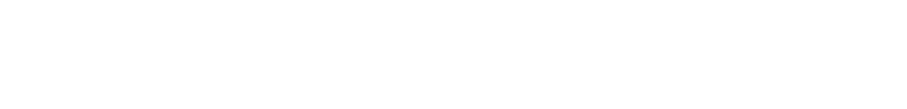

<div align="center">

<picture>
  <source media="(prefers-color-scheme: light)" srcset="docs/tesseract_logo.png">
  
</picture>

tesseract: The ultimate N-dimensional tensor library in C++, embedded systems optimized.

<h3>

[Homepage](https://github.com/tasosmitsi/tesseract) | [Documentation]() | [Discord]()

</h3>

</div>

---

## Overview
Tesseract is a versatile C++ library for handling N-dimensional tensors. This library is templated, allowing efficient static and dynamic tensor operations for embedded systems, scientific computing, deep learning, and other applications requiring high-dimensional data manipulation. The `TensorND` class is optimized for mathematical operations, supports tensor arithmetic, slicing, and provides an intuitive interface for various tensor transformations.

## Features
- **N-dimensional Support**: Supports tensors with any number of dimensions specified at compile-time.
- **Arithmetic Operations**: Element-wise addition, subtraction, multiplication, and division with scalars or other tensors.
- **Index-based Access**: Allows flexible access with variadic index operators and array-based indexing.
- **Transpose and Shape Manipulation**: Easily transpose tensors and retrieve shape information.
- **Utility Functions**: Generate identity tensors, set diagonal elements, initialize tensors to zero or random values.
- **Einsum-style Tensor Contraction**: Efficient contraction for performing complex tensor multiplications.
- **Memory Efficiency**: Supports copy and move constructors for efficient memory management.

## Installation
To use `TensorND`, simply include the `TensorND.h` header in your project and ensure that your compiler supports C++17 or later.

```cpp
#include "TensorND.h"
```

## Usage
To create a tensor, specify its data type and dimensions. For example, here’s a 2D tensor of size 3x3:

```cpp
TensorND<float, 3, 3> tensor;
```

### Basic Initialization and Operations
You can initialize a tensor with a specific value, access elements with indices, and perform arithmetic operations.

```cpp
// Initialize all elements to a specific value
TensorND<int, 2, 2> tensor(5);  // 2x2 tensor with all elements set to 5

// Accessing and modifying elements
tensor(0, 1) = 10;               // Set element at (0,1) to 10

// Adding a scalar to each element
auto tensor2 = tensor + 3;       // Each element incremented by 3

// Element-wise tensor addition
TensorND<int, 2, 2> result = tensor + tensor2;
```

## Examples
Here are a few examples of how to use `TensorND` to perform common tensor operations:

### Tensor Arithmetic

Addition, Subtraction, Multiplication, and Division:

```cpp
TensorND<double, 3, 3> mat1, mat2;
mat1.setIdentity();
mat2.setIdentity();

auto addition = mat1 + mat2;       // Tensor addition
auto subtraction = mat1 - mat2;    // Tensor subtraction
auto multiplication = mat1 * mat2; // Tensor multiplication
auto scalarDivision = mat1 / 2.0;  // Divide by a scalar
```

### Transposing a Tensor
For a 2D tensor (matrix), you can transpose it easily:

```cpp
TensorND<float, 2, 3> matrix;

// Initialize matrix values

matrix.transpose(True); // Only for 2D tensors, true for in-place transpose
// or
auto transposed = matrix.transpose(); // Transpose and return a new tensor (not in-place)

std::cout << "Shape: " << matrix.getShape();  // Get tensor shape
```

For a higher-dimensional tensor, you can permute the axes:

```cpp
TensorND<float, 2, 3, 4> tensor;

// Initialize tensor values

tensor.transpose([1, 2, 0], true); // Permute axes, true for in-place transpose
// or
auto permuted_tensor = tensor.transpose([1, 2, 0]); // Permute axes and return a new tensor (not in-place)

std::cout << "Shape: " << tensor.getShape();  // Get tensor shape
```

### Setting the Tensor to an Identity Matrix
You can quickly initialize a tensor as an identity matrix if it’s 2D and square.

```cpp
auto identity = TensorND<float, 3, 3>::I();
```

### Performing Element-Wise Multiplication
TensorND allows for element-wise operations between tensors of the same size:

```cpp
TensorND<int, 2, 2> tensorA, tensorB;
// Fill tensorA and tensorB with values
TensorND<int, 2, 2> product = tensorA * tensorB;
```

### Utility Functions

Setting Values:

```cpp
tensor.setToZero();                           // Set all elements to 0
tensor.setIdentity();                         // Set as identity
```

Random Initialization:

```cpp
tensor.setRandom(10, -10);                  // Random values between -10 and 10
```

Diagonal Elements:

```cpp
tensor.setDiagonal(1.0);                    // Set diagonal elements to 1.0
```

### Printing Tensors

Print 2D, 3D, or 4D tensors:

```cpp
tensor2D.print();                               // Prints 2D tensor
tensor3D.print();                             // Prints 3D tensor
tensor4D.print();                             // Prints 4D tensor
```

### Equality and Assignment

Compare Tensors:

```cpp
TensorND<double, 3, 3> mat1, mat2;
mat1.setIdentity();
mat2.setIdentity();

if (mat1 == mat2) {
    std::cout << "Tensors are equal!" << std::endl;
}

// or

if (mat1 != mat2) {
    std::cout << "Tensors are not equal!" << std::endl;
}
```

Assign One Tensor to Another:

```cpp
mat2 = mat1; // Assign mat1 to mat2
```

### Tensor Contraction (Einsum-style)

Perform tensor contraction using the `einsum` function:

```cpp
```

## How to run tests

It is recommended to run the tests to ensure that the library is working correctly. To run the tests, simply run:

```bash
make -j 20 run_test
```
